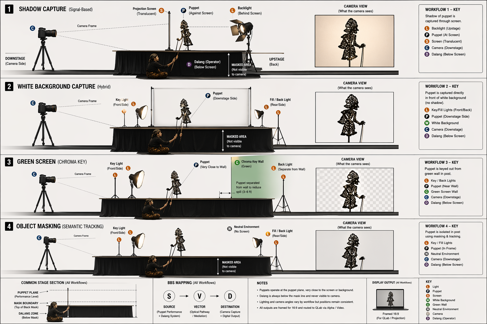

# Virtual Puppet Video Workflow Research – Statement of Work

**Attribution and Context**

This project is developed under the Center for Holistic Integration (CHI) at New York City College of Technology (City Tech, CUNY). It forms part of a larger meta-project investigation into the Balanced Blended Space (BBS) framework and its application within performative environments, including the Blended Shadow Puppet (BSP) initiative and the Blended Reality Performance System (BRPS).

Within this context, the present research focuses on video-based mediation pathways—specifically, the transformation of physical puppet performance into virtual assets suitable for compositing, playback, and integration within hybrid physical/virtual performance systems. The workflows evaluated here should therefore be understood not only as production techniques, but as experimental instances of BBS mediation across physical, virtual, and conceptual spaces.

# Virtual Puppet Video Workflow Research – Statement of Work

## Overview

This Statement of Work defines a structured research initiative to evaluate multiple video capture and post-production workflows for shadow puppet virtualization. The goal is to identify the most efficient, stable, and scalable pipeline for generating compositable puppet assets suitable for integration within QLab and the Blended Shadow Puppet (BSP) performance system.

This document is exploratory in nature. Unlike production-focused SoWs, this phase emphasizes controlled comparison across multiple approaches. The outcome will be a selected workflow that becomes the standard pipeline for subsequent capture and production work.

*Figure: Draft arrangement map for virtual puppet video workflow exploration.*

---

## Research Objectives

The primary objective is to compare distinct video workflows across technical, aesthetic, and operational dimensions in order to determine a preferred method for semester-scale deployment.

Key questions include:

- Which workflow produces the most stable alpha channel?
- Which approach minimizes post-processing time?
- Which method best preserves expressive motion and silhouette quality?
- Which pipeline is most accessible and repeatable for students?
- Which workflow aligns with future expansion toward computational and AI-mediated puppetry?

---

## Experimental Framework

Each workflow will be applied to the same controlled test sequence to ensure comparability.

Test sequence parameters:

- Single puppet
- Defined motion set (arm articulation, rotation, gesture)
- Fixed duration (10–15 seconds)
- Synchronized to a shared audio segment

All recordings should be captured under controlled and documented conditions.

---

## Workflows Under Investigation

The following workflows will be investigated as distinct but comparable approaches to puppet virtualization. Each workflow is described as a complete procedural chain beginning with installation and setup and ending with export and validation. The intention is to ensure that students are not merely comparing abstract methods, but executing reproducible engineering procedures whose strengths and weaknesses can be meaningfully assessed.

### Workflow 1 – Traditional Shadow Capture (Signal-Based)

This workflow preserves the most direct relationship to traditional Wayang Kulit practice. The puppet is performed as a shadow object between a light source and a projection surface, and the recorded image is processed to isolate the shadow as a usable alpha-bearing asset. This method is of particular interest because it captures not only the silhouette of the puppet, but also some of the micro-qualities of shadow behavior, including diffusion, edge softness, and slight temporal variation produced by physical performance.

#### Installation

The installation begins by constructing a stable shadow performance station. A white projection surface should be mounted so that it is taut, planar, and free from wrinkles or texture that would interfere with image extraction. A backlight source should be positioned behind the screen and aligned so that illumination is as even as possible across the full capture area. The puppet manipulation zone must be clearly defined between the light source and the screen. A camera is then installed in front of the screen, centered and perpendicular to the projection plane. The camera mount must be rigid so that no drift or vibration occurs over the course of testing. A playback monitor or speaker system should also be installed so that performers can work in synchronization with the audio track.

#### Configuration

Once installed, the system must be configured so that all variable image parameters are fixed. Camera settings should be placed in manual mode. Exposure, white balance, focus, and frame rate must be locked. Resolution should be set above the intended delivery resolution where possible, since oversampling will help with later edge refinement. The backlight intensity should be adjusted until the empty screen produces a bright but non-clipped image. No other room lighting should contaminate the projection surface. The audio playback system should be configured to reproduce the master track clearly without introducing acoustic feedback into the recording space.

#### Calibration

Calibration begins with an empty-screen test. The screen is recorded without any puppet present in order to generate a clean plate. This capture serves both as a subtraction reference and as a diagnostic image for lighting uniformity. The operator should inspect the recorded frame for gradients, hotspots, edge falloff, flicker, and sensor noise. If the screen is not uniform, the lighting must be adjusted before proceeding. A second calibration pass should then be performed with a puppet held in static positions near the center and near the edges of the frame. This test determines whether shadow sharpness remains sufficiently consistent across the capture region. Audio synchronization should also be checked at this stage by playing a short reference segment and verifying that the performer can respond to it consistently.

#### Capture

During capture, the performer executes the test sequence or scripted scene while monitoring the master audio track. Multiple takes should be recorded for each sequence. The first take should prioritize correct synchronization and framing, while subsequent takes can be used to refine gesture quality and articulation. Each take must be logged with date, performer, puppet identifier, workflow identifier, and any environmental notes. If the workflow is being compared experimentally, one should avoid changing the lighting or camera settings between takes unless a new test condition is being intentionally introduced. The clean plate must be retained with the associated footage for later processing.

#### Post-Processing

The recorded footage is first normalized for exposure and framing consistency. The clean plate is then used to perform difference matting, subtracting the empty screen from the performance footage in order to isolate the moving shadow. The resulting preliminary matte is refined through levels adjustment and noise suppression. Thresholding may be used cautiously, but should not be allowed to introduce edge flicker or temporal instability. If necessary, edge cleanup tools such as blur, erosion, or dilation may be applied in moderation. A provisional alpha channel is then generated and tested over contrasting backgrounds.

#### Validation

Validation should be performed both frame-by-frame and in continuous playback. The operator should verify that the shadow reads cleanly, that the edges remain stable over time, and that no significant background residue remains after isolation. The resulting alpha asset should be tested in QLab against white, black, and textured backgrounds to determine whether halos or instability become visible at projection scale. Any recurrent artifacts should be documented as workflow limitations.

#### Export

The final output should be exported as Apple ProRes 4444 with alpha, using a frame rate and resolution consistent with the target QLab environment. Naming conventions should identify workflow, puppet, scene, and version number. Intermediate project files should be preserved so that changes in thresholding or subtraction parameters can be revisited later if necessary.

---

### Workflow 2 – White Background Foreground Capture (Hybrid)

This workflow records the puppet itself, rather than the shadow, against a controlled white background. The intention is to isolate the puppet as an object and then reconstruct the visual logic of the shadow during post-production. This approach occupies a middle position between purely signal-based shadow capture and fully synthetic digital reconstruction.

#### Installation

The installation requires a white backdrop large enough to completely contain the puppet motion area. Unlike the shadow-capture setup, the puppet is positioned in front of the backdrop rather than between a light source and projection screen. The background must be evenly lit, while the puppet is lit separately so that it is clearly distinguished from the white field. The camera is mounted directly in front of the backdrop, centered and perpendicular to it. Sufficient separation should be maintained between puppet and backdrop to reduce unwanted cast shadows and to preserve clear edge definition. Audio playback equipment should be installed in the same manner as in Workflow 1.

#### Configuration

The background lighting should be adjusted until the white field appears consistent without clipping so severely that edge information is lost. Puppet lighting should be configured to provide sufficient contrast while avoiding flatness or spill that merges the puppet with the background. Camera exposure must again be locked manually. White balance is especially important here, since an incorrect setting can reduce effective separation between puppet and backdrop. Focus should be set to prioritize the puppet plane. Frame rate and resolution should match the experimental standard established for the research series.

#### Calibration

Calibration begins with an empty background recording to check for lighting uniformity and clipping. A static puppet should then be introduced at several positions in the frame so that edge visibility can be assessed. Particular attention should be given to fine details, rods, and any semi-translucent components, since these may be harder to isolate against white. If the puppet materials or rods are too similar in brightness to the backdrop, either the lighting ratio or background choice may need adjustment. A short motion calibration should also be recorded to determine whether motion blur causes edge loss.

#### Capture

The test sequence is then performed in synchronization with the master audio. Multiple takes should be recorded under identical lighting and camera conditions. Because this workflow relies on object segmentation rather than direct shadow capture, particular care should be taken to keep the puppet within the calibrated region of the frame. Operators should note whether any parts of the puppet visually disappear into the white field during fast motion or rotation.

#### Post-Processing

The footage is processed using luma-based separation, object masking, or a hybrid of both. Initial segmentation should attempt to isolate the puppet from the white background while retaining fine details and minimizing edge chatter. Object masking tools may be used to improve separation where luma contrast is insufficient. Once the puppet is isolated and alpha is generated, the resulting asset can be rendered as a black silhouette or otherwise transformed to emulate shadow behavior. This stage allows experiments with blur, opacity, edge diffusion, and color assignment.

#### Validation

Validation should assess not only extraction quality, but also the success of the reconstructed shadow aesthetic. The operator should compare the rendered result to the original visual expectations of Wayang Kulit shadow behavior. Edge clarity, temporal stability, and the visibility of rods and articulated details should all be checked during projection tests in QLab. This workflow should also be evaluated for how easily the isolated puppet can be stylized or repurposed for alternate rendering schemes.

#### Export

Exports should again be produced as ProRes 4444 with alpha. If multiple rendered styles are produced from the same source capture, each should be versioned separately and documented as a sub-variant of Workflow 2. Processing notes should record whether the final alpha came primarily from luma separation, object masking, or a combination of the two.

---

### Workflow 3 – Green Screen Capture (Chroma Key)

This workflow uses a chroma-key background to isolate the puppet. It is expected to produce the cleanest and most modular alpha-bearing assets when capture conditions are well controlled. The tradeoff is that the visual output is no longer a direct record of actual shadow behavior, but rather a foreground object that must be re-rendered as shadow in post-production.

#### Installation

A green screen should be installed so that it fills the entire background area visible to the camera and remains smooth and evenly tensioned. The puppet performance area must be positioned several feet in front of the green screen so that the puppet can be lit independently and to reduce spill contamination on edges. Separate lighting systems should be installed for the green background and the puppet. The background lights should provide uniform illumination, while the puppet lights should define the object clearly without creating specular reflections or color contamination. The camera is mounted frontally, centered on the capture region, and secured to prevent movement.

#### Configuration

Configuration begins by balancing the green screen lighting so that it is evenly exposed but not oversaturated. The puppet lighting must then be adjusted independently. Exposure should be set manually so that the green background remains within a strong keyable range while preserving edge detail on the puppet. White balance should be locked after both lighting systems are stable. Particular attention must be paid to material-specific behavior: reflective plastics, metallic surfaces, and semi-translucent materials may require changes in angle or intensity to reduce spill and edge contamination.

#### Calibration

Calibration should begin with an empty green screen recording to verify lighting uniformity. A static puppet is then placed in the frame and inspected for green spill, reflections, and edge transparency. Fine rods and thin appendages should be tested separately, since these often challenge keying systems. If spill is visible, the distance between puppet and screen should be increased, or the puppet lighting should be adjusted to provide stronger edge separation. A brief motion calibration should then be recorded to determine whether fast gestures create motion blur that complicates keying.

#### Capture

The performer executes the standardized motion sequence or scripted segment while synchronized audio plays back. Multiple takes should be recorded without changing camera or lighting conditions unless a separate test condition is being introduced. Each take should be logged with specific notes about material behavior, especially if any portions of the puppet become difficult to key because of translucency or reflection.

#### Post-Processing

The footage is processed first through a chroma key. Spill suppression should then be applied to neutralize green contamination on puppet edges. Edge refinement follows, using choke, feather, or matte cleanup tools as needed. If rods, semi-translucent details, or overlapping puppet components do not key satisfactorily, object masking may be applied as a secondary corrective layer. Once alpha is stable, the isolated puppet is rendered into the desired shadow form, typically as a black or darkened silhouette composited over white or other scenic backgrounds.

#### Validation

Validation should test both raw extraction quality and reconstructed shadow quality. The operator should check for residual green edges, matte chatter, disappearing rods, and motion-based key failure. Projection tests in QLab should verify that the keyed asset holds up at performance scale and that the rendered silhouette remains visually convincing in the context of BSP staging. Since this workflow is likely to be efficient for student production, processing time and setup sensitivity should be carefully documented.

#### Export

The final export is ProRes 4444 with alpha, versioned according to workflow, puppet, and scene. It may also be useful to save a secondary review render with the alpha composited over a white field so that non-editing team members can quickly assess the resulting shadow aesthetic without opening editing software.

---

### Workflow 4 – Object-Based Masking (Semantic Tracking)

This workflow introduces semantic object masking as either a primary or corrective isolation strategy. It is especially relevant where background-based extraction methods fail or where greater control over overlapping forms and complex silhouettes is required. This workflow may be applied to footage captured through any of the previous methods, but it is treated here as an independent procedural path because of its distinct labor model and technical behavior.

#### Installation

Because object masking is a post-production-centered workflow, installation focuses less on specialized background infrastructure and more on ensuring that the captured footage is suitable for tracking. The camera installation should provide stable framing, consistent focus, and sufficient resolution for masks to hold accurately on fine edges. If new footage is being recorded specifically for masking, the environment should still prioritize clear separation between puppet and background, though uniform chroma or luminance conditions are not as strictly required as in the previous workflows.

#### Configuration

Configuration centers on recording settings that support robust tracking. High shutter speeds may be desirable to reduce motion blur, since blurred edges reduce mask accuracy. Resolution should be kept high enough to preserve fine articulations. If masking is expected to be the primary extraction method, the scene should be lit to maximize local contrast around puppet edges rather than to satisfy keying constraints. Editorial software settings should also be standardized so that mask feathering, tracking mode, and output mattes are comparable across tests.

#### Calibration

Calibration consists of short trial clips in which the puppet performs representative motions, including overlapping limbs, rotations, and fine rod movement. These clips are imported into the masking environment and tracked over a short duration to determine how well the software maintains edge alignment over time. Particular attention should be given to mask drift, edge swimming, and failure when puppet components occlude one another. If tracking is unstable, the footage may need improved contrast, reduced motion blur, or manual keyframe intervention.

#### Capture

If additional capture is required specifically for this workflow, the test motion should be recorded with stable framing and controlled timing, again synchronized to the master audio. Because object masking can be labor-intensive, the scope of capture should remain modest during the research phase. The goal is not to process a full scene immediately, but to determine whether the method offers enough precision or flexibility to justify its use in specific situations.

#### Post-Processing

The operator creates an object mask around the puppet and tracks it through the shot using the chosen software. Manual corrections are applied where the tracking loses accuracy. Multiple masks may be required for separate puppet components if they move independently or overlap in complex ways. Once the mask is stable, an alpha channel is generated. Depending on the original footage, this alpha may be combined with luma or chroma-derived separation to improve edge behavior. The isolated object is then rendered into a shadow form suitable for projection.

#### Validation

Validation should focus heavily on temporal coherence. Even a visually accurate mask on individual frames may fail during playback if edges swim or drift. Projection testing in QLab is therefore essential. The operator should assess whether the masked result appears stable enough for performance use and whether the additional labor produces a meaningful improvement over simpler workflows. This workflow should also be judged for its usefulness as a fallback method when other isolation strategies are insufficient.

#### Export

Exports follow the same ProRes 4444 with alpha standard. Because masking workflows may involve significant manual intervention, versioning and documentation are especially important. Notes should include the extent of manual correction, the duration of labor per clip, and whether masking was used as a primary extraction method or as a supplement to another workflow.

## Evaluation Criteria

Each workflow will be evaluated using the following criteria:

### Technical Performance
- Alpha channel stability
- Edge quality and consistency
- Noise and artifact presence
- Compatibility with QLab playback

### Aesthetic Quality
- Readability of silhouette
- Preservation of expressive motion
- Visual coherence under projection

### Workflow Efficiency
- Time required for processing
- Complexity of setup and execution
- Ease of replication by students

### System Integration
- Compatibility with layered QLab cue structures
- Modularity of generated assets
- Alignment with future computational/AI systems

---

## Test Procedure

Each workflow will follow the same evaluation process:

1. Capture test sequence
2. Process to alpha using defined method
3. Export to ProRes 4444
4. Import into QLab
5. Composite over standardized backgrounds
6. Evaluate playback under projection conditions

All steps must be documented for reproducibility.

---

## Documentation and Repository Requirements

All results, including raw footage, processed assets, project files, evaluation notes, and comparative analyses, must be recorded and organized within the appropriate GitHub repository associated with the CHI meta-project structure. Each workflow test should be documented as a discrete entry, including:

- Capture configuration (camera, lighting, environment)
- Material and puppet specifications
- Processing methodology (software, parameters, masking/keying approach)
- Observed issues and mitigation strategies
- Final exported assets

Repository organization should follow a consistent folder structure so that results can be compared across teams and across semesters. This documentation is considered a core deliverable of the research phase and is required for inclusion in the broader CHI knowledge system.

## Framing and Presentation Constraints

All captured and processed video assets must conform to the physical and spatial constraints of the BSP projection environment. The presentation system is defined as a 16:9 aspect ratio surface with a horizontal width of 6 feet. Accordingly, all workflows must ensure that:

- Framing is composed for a 16:9 output ratio
- Puppet scale is appropriate for a 6-foot-wide projection surface
- Motion remains within safe margins to avoid edge clipping
- Resolution is sufficient to maintain edge clarity at projection scale

Test compositions within QLab must simulate this final presentation condition. Any workflow that produces acceptable results at monitor scale but fails at projection scale should be documented as insufficient without further refinement.

## Deliverables

- Video assets for each workflow (alpha-enabled)
- QLab session with test compositions
- Comparative analysis documentation
- Workflow selection recommendation
- Comprehensive documentation of all test results and outcomes, including both successful and unsuccessful approaches, recorded in the GitHub repository and suitable for future reference and reuse

- Video assets for each workflow (alpha-enabled)
- QLab session with test compositions
- Comparative analysis documentation
- Workflow selection recommendation

---

## Decision Outcome

At the conclusion of this research phase, one workflow will be selected as the primary production pipeline based on:

- Reliability
- Efficiency
- Visual quality
- Scalability for student use

This selected workflow will be formalized into a production SoW for full-scale BSP implementation.

---

## Summary

This research SoW establishes a structured comparison of video capture and post-production approaches for shadow puppet virtualization. By evaluating multiple workflows under controlled conditions, the project aims to identify a robust and scalable pipeline that supports both immediate performance needs and long-term system development.

